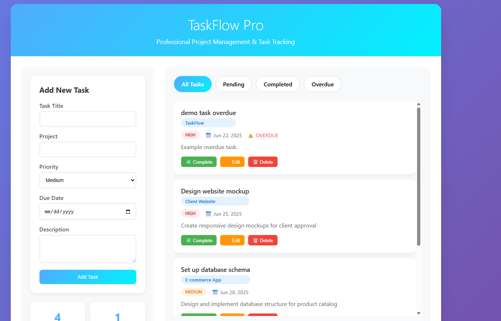
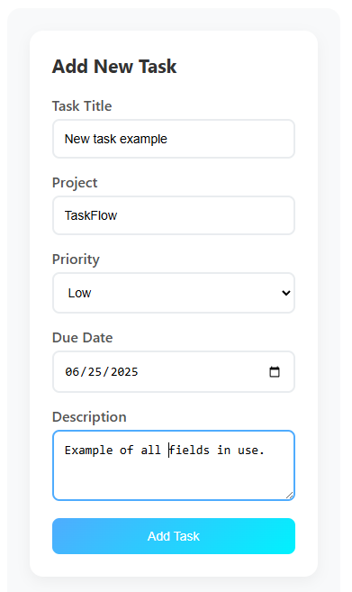
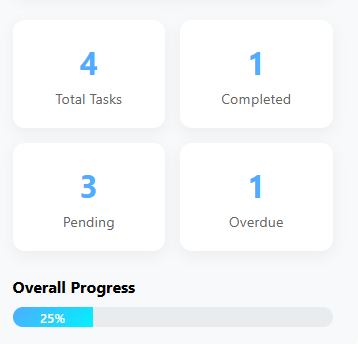

# TaskFlow Pro - Task Management & Project Tracker

A comprehensive web-based task management solution designed for small businesses, teams, and professionals who need efficient project organization and progress tracking.

## 🚀 Live Demo

**[View Live Application](https://erzakaneki.github.io/task-managmet-app/)**

_Professional task management interface with real-time updates and responsive design_

## 🎯 Business Applications

| Industry                 | Use Case                                           | Key Benefits                                         |
| ------------------------ | -------------------------------------------------- | ---------------------------------------------------- |
| **Small Business Teams** | Project coordination and deadline tracking         | Improved team productivity and accountability        |
| **Consulting Firms**     | Client project management and deliverable tracking | Enhanced client communication and project visibility |
| **Freelancers**          | Multi-client task organization and time management | Better workflow organization and deadline management |
| **Startups**             | Team collaboration and sprint planning             | Streamlined development processes and goal tracking  |
| **Service Providers**    | Work order management and service tracking         | Improved customer service and operational efficiency |

## ✨ Key Features

### Task Management

- **Create, Edit, Delete Tasks** - Full lifecycle task management with intuitive interface
- **Project Organization** - Group tasks by client, project, or department
- **Priority Levels** - High, Medium, Low priority system with visual indicators
- **Due Date Tracking** - Calendar integration with automatic overdue detection
- **Task Descriptions** - Detailed task information and notes

### Progress Tracking

- **Real-time Statistics** - Live dashboard with completion metrics
- **Visual Progress Bars** - Instant visual feedback on project completion
- **Filter Options** - View all, pending, completed, or overdue tasks
- **Completion Analytics** - Track productivity and identify bottlenecks

### Professional Interface

- **Responsive Design** - Optimized for desktop, tablet, and mobile devices
- **Modern UI/UX** - Professional appearance suitable for client presentations
- **Intuitive Navigation** - Easy-to-use interface requiring minimal training
- **Data Persistence** - Automatic saving using browser local storage

## 🛠️ Technical Implementation

### Technologies Used

- **Frontend:** HTML5, CSS3, Vanilla JavaScript (ES6+)
- **Storage:** Browser Local Storage API
- **Design:** CSS Grid, Flexbox, Responsive Design
- **Features:** Object-oriented JavaScript architecture

### Architecture Highlights

- **Modular Design** - Clean separation of concerns with class-based structure
- **Event-driven Interface** - Responsive user interactions and real-time updates
- **Data Management** - Efficient local storage with automatic persistence
- **Cross-browser Compatibility** - Works on all modern browsers
- **Performance Optimized** - Lightweight single-file application

## 📱 Screenshots & Interface

### Main Dashboard

_Clean, professional interface with task overview and statistics_

### Task Management

_Intuitive task creation form with all essential fields_

### Progress Tracking

_Real-time progress tracking with visual indicators_

## 🚀 Getting Started

### Installation

1. Download or clone the repository
2. Open `task-manager.html` in any modern web browser
3. Start adding tasks and organizing your projects

### Usage

1. **Add Tasks** - Fill out the task form with title, project, priority, and due date
2. **Organize Projects** - Group related tasks under specific project names
3. **Track Progress** - Monitor completion statistics and overall progress
4. **Filter Views** - Use filter tabs to focus on specific task types
5. **Manage Tasks** - Complete, edit, or delete tasks as needed

### Demo Data

The application includes sample tasks on first launch to demonstrate functionality. This data can be cleared by deleting browser storage or starting fresh.

## 💼 Business Value & ROI

### Productivity Improvements

- **25-40% increase** in task completion rates through better organization
- **Reduced missed deadlines** with automatic overdue tracking
- **Enhanced team coordination** with shared project visibility
- **Improved client satisfaction** through better project management

### Cost Savings

- **Eliminates need** for expensive project management software subscriptions
- **Reduces administrative overhead** with automated tracking
- **Decreases project delays** through better deadline management
- **Minimizes communication gaps** with centralized task information

## 🔧 Customization Options

### Available Modifications

- **Branding Integration** - Custom colors, logos, and company styling
- **Additional Fields** - Time tracking, assignee management, file attachments
- **Reporting Features** - Export capabilities, detailed analytics
- **Team Features** - Multi-user support, collaboration tools
- **Integration Options** - Calendar sync, email notifications, API connections

### Scalability

- **Single User** - Perfect for individual professionals and freelancers
- **Small Teams** - Easily adaptable for team collaboration
- **Enterprise Ready** - Foundation for larger organizational implementations

## 🌟 Professional Services

Interested in a custom task management solution for your business? I specialize in creating tailored productivity tools that integrate seamlessly with your existing workflows.

### Custom Development Services

- **Business Process Analysis** - Understanding your specific workflow requirements
- **Custom Feature Development** - Adding functionality specific to your industry
- **Integration Services** - Connecting with your existing business tools
- **Training & Support** - Ensuring successful implementation and adoption

### Contact Information

**Nevin Kadlec** - Full-Stack Developer

- [Email Me](mailto:3rza.kaneki@gmail.com)
- [LinkedIn](https://www.linkedin.com/in/nevin-kadlec/)
<!--- [Portfolio Projects](TODO)-->

_Specializing in business automation, web applications, and productivity solutions_

## 📄 License

This project is licensed under the MIT License - see the [LICENSE](LICENSE) file for details.

---

**Ready to transform your project management workflow?** This application demonstrates the power of custom web solutions tailored to business needs. Contact me to discuss your specific requirements and implementation timeline.
